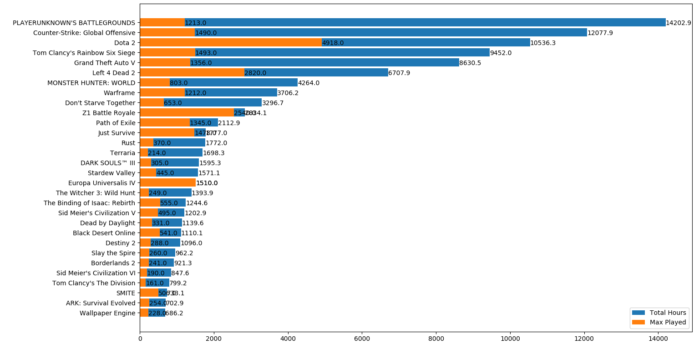

This is a steam friends analysis project
In main.py set your steam cookie (steamLoginSecure) and run it,
the program will generate a file with your friends data.
Now run analysis.py, it will generate a result graph,
like this

blue line is total hours of my friends are played,
orange line is hours of max played.